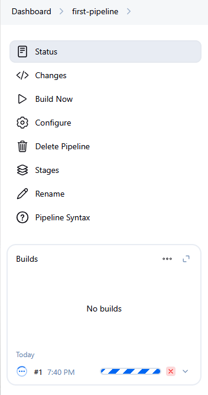

## A Simple Jenkins Pipeline to verify if the docker agent configuration is working fine.

### When we clicked on 'Build Now':

### Post completion:

### & here Jenkins asked Docker to create a container so it can execute the scripts and then deletes it.

Therefore we won't see any Docker process anymore in the jenkins pipeline

### So. the takeaway is based on the requirement, the docker container gets created and then removes it. (We won't need static worker nodes or autoscalers 
#### ( where managing the VM with upgrades, specific modules is a task ) 
### & we save a lot of cost)